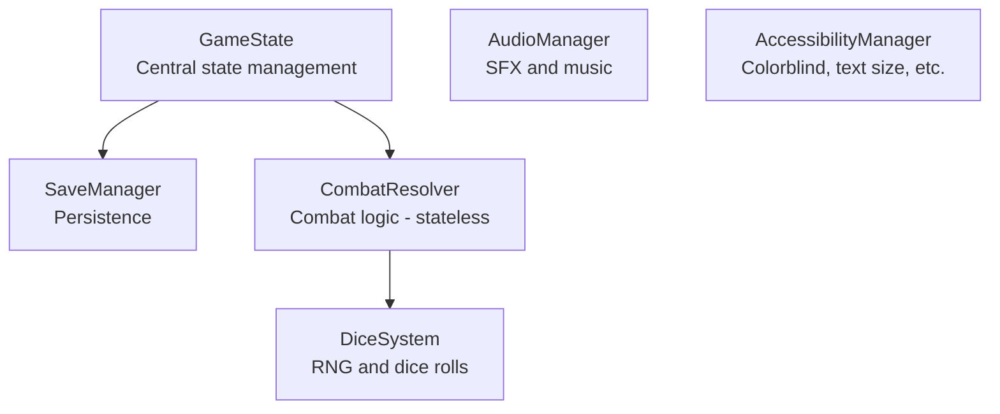
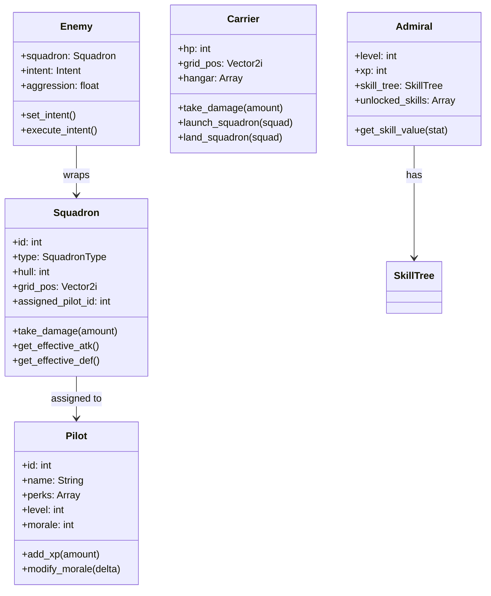
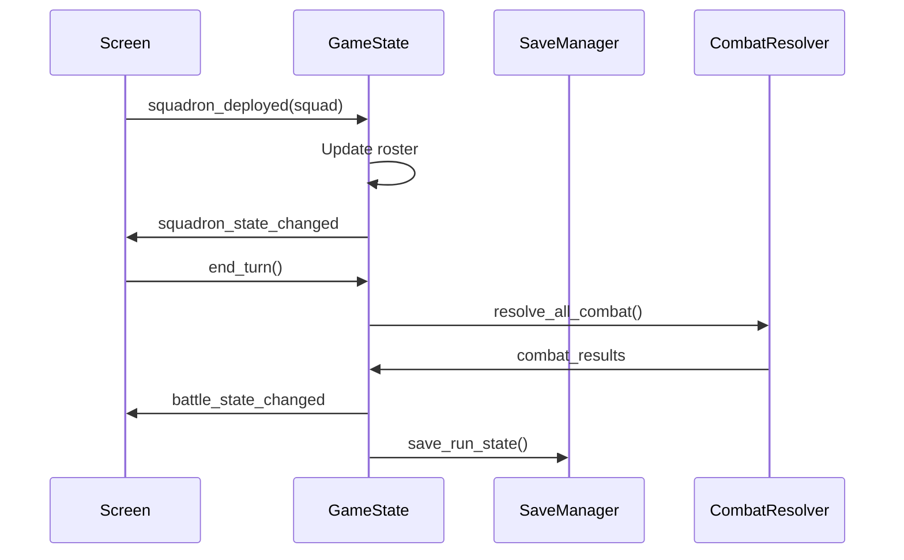

# Architecture

Exodus Loop follows a singleton-based architecture with signal-driven communication between systems.

## Autoload Singletons



### Additional Singletons

| Singleton | Purpose |
|-----------|---------|
| AudioManager | SFX pool (8 concurrent), music with fade |
| HapticsManager | Touch feedback and vibration patterns |
| AccessibilityManager | Colorblind mode, text scaling, screen reader |
| StatisticsManager | Career/battle/run stat tracking |
| AchievementManager | Achievement unlock tracking |

### GameState (game_state.gd)

**Responsibility:** Central state management for runs and meta-progression

**Key Data:**
- `squadron_roster: Array[Squadron]` - Player squadrons
- `pilot_roster: Array[Pilot]` - Available pilots
- `enemy_roster: Array[Enemy]` - Current battle enemies
- `meta_xp: int` - Cross-run currency
- `unlocked_upgrades: Array[String]` - Purchased upgrades
- `current_admiral: Admiral` - Player's admiral

**Key Methods:**
```gdscript
# Grid helpers
is_valid_cell(pos: Vector2i) -> bool
get_adjacent_cells(pos: Vector2i) -> Array[Vector2i]
get_distance(from: Vector2i, to: Vector2i) -> int
get_cell_name(pos: Vector2i) -> String

# State management
start_new_run() -> void
end_run(victory: bool) -> void
purchase_upgrade(id: String) -> bool
```

### SaveManager (save_manager.gd)

**Responsibility:** JSON-based persistence

**Save Types:**
- **Meta saves:** XP, unlocks, admiral, blessed squadrons (persistent)
- **Run saves:** Current run state (cleared on completion)

**Key Methods:**
```gdscript
save_meta_state() -> void
load_meta_state() -> bool
save_run_state() -> void
load_run_state() -> bool
has_saved_run() -> bool
```

### CombatResolver (combat_resolver.gd)

**Responsibility:** Stateless combat resolution

**Key Methods:**
```gdscript
get_all_contested_cells() -> Array[Vector2i]
resolve_cell_combat(cell_pos: Vector2i) -> CombatLog
check_interception(squad, from, to) -> InterceptionResult
resolve_interception(result: InterceptionResult) -> void
```

### DiceSystem (dice_system.gd)

**Responsibility:** All RNG operations

**Key Methods:**
```gdscript
roll_initiative(spd: int) -> DiceRoll
roll_damage(atk: int, def: int, die_type: DiceType) -> DiceRoll
roll_combat_damage(attacker: Squadron, defender: Squadron) -> DiceRoll
get_rps_die(attacker_type: int, defender_type: int) -> DiceType
```

---

## Entity Hierarchy



---

## Signal Flow



### Key Signals

**GameState:**
```gdscript
signal squadron_deployed(squadron: Squadron)
signal squadron_destroyed(squadron: Squadron)
signal turn_ended(turn_number: int)
signal battle_started()
signal battle_ended(victory: bool)
signal run_ended(victory: bool, stats: Dictionary)
signal upgrade_purchased(upgrade_id: String)
```

**Screen Navigation:**
```gdscript
signal screen_change_requested(screen_name: String, params: Dictionary)
```

---

## Screen Navigation

Screens communicate with `main.gd` via signals:

```gdscript
# In any screen
signal screen_change_requested(screen_name: String, params: Dictionary)

# Request transition
screen_change_requested.emit("battle", {"node_id": node_id})

# main.gd handles the transition
func _on_screen_change_requested(name: String, params: Dictionary) -> void:
    _transition_to_screen(name, params)
```

See [[screens|Screen Navigation]] for the full state machine.

---

## Code Patterns

### Grid Position Helpers

```gdscript
# Check if position is valid
if GameState.is_valid_cell(pos):
    # Safe to use position

# Get adjacent cells
var neighbors = GameState.get_adjacent_cells(pos)

# Get Manhattan distance
var dist = GameState.get_distance(from_pos, to_pos)

# Get cell name (A1, B2, etc.)
var name = GameState.get_cell_name(pos)
```

### Entity Lifecycle

```gdscript
# Creating entities
var squadron = Squadron.new()
squadron.initialize(type, grid_pos)
GameState.squadron_roster.append(squadron)

# Destroying entities
func _on_squadron_destroyed(squadron: Squadron) -> void:
    GameState.remove_squadron(squadron)
    squadron.queue_free()
```

### Action Assignment

```gdscript
# Assign action to squadron
squadron.pending_action = Squadron.Action.ATTACK
squadron.pending_target_pos = target_pos

# Clear on resolution
func _clear_all_actions() -> void:
    for squad in GameState.squadron_roster:
        squad.pending_action = Squadron.Action.NONE
        squad.pending_target_pos = Vector2i(-1, -1)
```

---

## File Organization

### Adding New Screens

1. Create `src/screens/name/name_screen.gd`
2. Create `src/screens/name/name_screen.tscn`
3. Add to `main.gd` screen loader
4. Emit `screen_change_requested` signal to navigate

### Adding New Components

1. Create `src/ui/components/name.gd`
2. Create `src/ui/components/name.tscn`
3. Use `class_name` for easy referencing

### Adding New Entities

1. Create `src/entities/name.gd`
2. Follow existing entity patterns (id, serialization)
3. Add to relevant roster in GameState

---

## Core Systems

### Ship Builder V2

The polyomino-based carrier construction system:

| File | Purpose |
|------|---------|
| `src/data/carrier/carrier_class_template.gd` | Class definitions and guaranteed pieces |
| `src/systems/ship_builder/ship_configuration_v2.gd` | Component placement and validation |
| `src/systems/ship_builder/directional_damage.gd` | Sector-based damage calculation |
| `src/systems/collision/capital_collision.gd` | Ship-to-ship collision handling |

### Component Draw Manager

Handles component pool for each run:

| File | Purpose |
|------|---------|
| `src/systems/component_draw/component_draw_manager.gd` | Run-start component drawing |
| `src/data/fleet/exodus_fleet.gd` | Persistent fleet extraction |

### Reinforcement System

Controls multi-wave encounters:

| File | Purpose |
|------|---------|
| `src/systems/reinforcement_manager.gd` | Wave triggers and spawning |

### Crafting System

Blueprint-based component crafting:

| File | Purpose |
|------|---------|
| `src/data/crafting/blueprint_registry.gd` | All available blueprints |
| `src/systems/crafting/build_queue_manager.gd` | Build queue (max 3) |
| `src/systems/crafting/blueprint_drop_calculator.gd` | Drop chance calculation |

---

## Key Data Classes

### DrawnComponent

Component drawn for current run:

```gdscript
class DrawnComponent:
    var component_type: ComponentType
    var shape: ShapeType
    var rarity: Rarity
    var traits: Array[String]
    var source: String  # "guaranteed", "bonus_draw", "exodus_fleet"
```

### ExtractedComponent

Component saved to Exodus Fleet:

```gdscript
class ExtractedComponent:
    var id: String
    var component_type: ComponentType
    var rarity: Rarity
    var damage_percent: float
    var extraction_run_id: String
```

### WaveConfig

Reinforcement wave configuration:

```gdscript
class WaveConfig:
    var trigger: WaveTrigger
    var trigger_value: int
    var fighter_count: int
    var spawn_position: SpawnPosition
```
