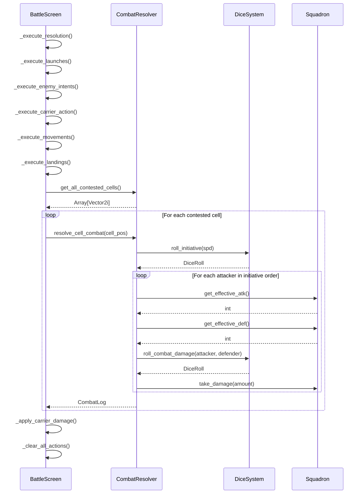

# Combat Implementation

Technical documentation for the combat system implementation.

> **Note:** As of v0.5.30, single-occupancy tactical combat is enabled by default (`battle_state.single_occupancy_enabled = true`). This changes movement blocking, dogfight resolution, and weapon behavior. See [[../game-design/combat#single-occupancy-tactical-mode|Single-Occupancy Tactical Mode]] for gameplay details.

## File Locations

| File | Purpose |
|------|---------|
| `src/autoload/combat_resolver.gd` | Core combat logic |
| `src/autoload/dice_system.gd` | Dice rolls and RNG |
| `src/screens/battle/battle_screen.gd` | Phase management, UI |
| `src/entities/squadron.gd` | Unit stats, effective values |

---

## Resolution Flow



---

## Initiative System

**File:** `combat_resolver.gd:148-175`

```gdscript
func resolve_cell_combat(cell_pos: Vector2i) -> CombatLog:
    var combat_log = CombatLog.new()
    combat_log.cell_pos = cell_pos

    # Gather all units in cell
    var all_units: Array = []
    for squad in GameState.squadron_roster:
        if squad.grid_pos == cell_pos:
            all_units.append(squad)
    for enemy in GameState.enemy_roster:
        if enemy.squadron.grid_pos == cell_pos:
            all_units.append(enemy.squadron)

    # Roll initiative for each
    var initiatives: Array = []
    for unit in all_units:
        var roll = DiceSystem.roll_initiative(unit.spd)
        initiatives.append({
            "unit": unit,
            "roll": roll.total,
            "spd": unit.spd
        })

    # Sort by roll (desc), then spd (desc)
    initiatives.sort_custom(func(a, b):
        if a.roll != b.roll:
            return a.roll > b.roll
        return a.spd > b.spd
    )

    combat_log.initiative_order = initiatives
    # Continue with attack resolution...
```

---

## Damage Calculation

**File:** `dice_system.gd:88-112`

```gdscript
static func roll_combat_damage(attacker: Squadron, defender: Squadron) -> DiceRoll:
    # Determine die type from RPS relationship
    var die_type = get_rps_die(attacker.type, defender.type)

    # Get effective stats
    var atk = attacker.get_effective_atk()
    var def = defender.get_effective_def()

    # Roll the die
    var roll = DiceRoll.new(die_type, atk)
    roll.base_roll = randi_range(1, die_type)

    # Calculate damage
    roll.total = maxi(0, roll.base_roll + atk - def)

    return roll

static func get_rps_die(attacker_type: int, defender_type: int) -> DiceType:
    # Frigate always neutral
    if attacker_type == Squadron.SquadronType.FRIGATE or \
       defender_type == Squadron.SquadronType.FRIGATE:
        return DiceType.D6

    # Check advantage
    var advantage = Squadron.TYPE_ADVANTAGE
    if advantage.get(attacker_type) == defender_type:
        return DiceType.D10  # Attacker has advantage
    elif advantage.get(defender_type) == attacker_type:
        return DiceType.D4   # Attacker has disadvantage
    else:
        return DiceType.D6   # Neutral
```

---

## Effective Stats

**File:** `squadron.gd:438-546`

```gdscript
func get_effective_atk() -> int:
    var effective = atk

    # Action modifiers
    if pending_action == Action.ATTACK:
        effective += 1
    elif pending_action == Action.DEFEND:
        effective += 1

    # Pilot bonuses
    effective += _get_pilot_stat_bonus("atk")
    effective += _get_pilot_morale_modifier("atk")

    # Trait bonuses
    effective += _get_trait_atk_bonus()

    # Admiral bonuses (player only)
    if not is_enemy:
        effective += _get_admiral_atk_bonus()

    # Fire Control Network
    effective += _get_fire_control_bonus()

    # Grid position modifiers
    if is_on_grid():
        effective += GameState.get_accuracy_modifier(grid_pos)

    return effective

func get_effective_def() -> int:
    var effective = def

    # Action modifiers
    if pending_action == Action.DEFEND:
        effective += 2

    # Pilot bonuses
    effective += _get_pilot_stat_bonus("def")
    effective += _get_pilot_morale_modifier("def")

    # Passive abilities
    if _get_pilot_passive_effect("last_stand") and hull * 2 <= max_hull:
        effective += 2

    # Trait bonuses
    effective += _get_trait_def_bonus()

    # Hazard bonuses
    if is_on_grid():
        effective += GameState.get_hazard_def_bonus(grid_pos)

    return effective
```

---

## Fire Control Network

**File:** `squadron.gd:691-724`

```gdscript
func _get_fire_control_bonus() -> int:
    var bonus: int = 0

    # Must be on grid
    if not is_on_grid():
        return 0

    # Find adjacent Frigates in DEFEND mode
    for squadron in GameState.squadron_roster:
        # Skip self
        if squadron == self:
            continue

        # Must be Frigate
        if squadron.type != SquadronType.FRIGATE:
            continue

        # Must be same team
        if squadron.is_enemy != is_enemy:
            continue

        # Must be in DEFEND mode
        if squadron.pending_action != Action.DEFEND:
            continue

        # Must be on grid
        if not squadron.is_on_grid():
            continue

        # Must be adjacent (Manhattan distance = 1)
        if GameState.get_distance(grid_pos, squadron.grid_pos) == 1:
            bonus += 1

    return bonus
```

---

## Destroyer Torpedo Salvo

**File:** `combat_resolver.gd:268-295`

```gdscript
func _resolve_attack(attacker: Squadron, defender: Squadron) -> DogfightResult:
    var result = DogfightResult.new()
    result.attacker = attacker
    result.defender = defender

    # Roll damage
    result.attacker_roll = DiceSystem.roll_combat_damage(attacker, defender)

    # Destroyer armor piercing
    if attacker.type == Squadron.SquadronType.DESTROYER:
        result.armor_piercing = 1
        var ignored_def = mini(result.armor_piercing, defender.get_effective_def())
        result.damage_to_defender += ignored_def

    # Apply damage
    result.damage_to_defender += result.attacker_roll.total
    defender.take_damage(result.damage_to_defender)
    result.defender_destroyed = defender.hull <= 0

    # Torpedo splash damage
    if attacker.type == Squadron.SquadronType.DESTROYER:
        var adjacent_enemies = _get_adjacent_enemies(defender.grid_pos, attacker.is_enemy)
        for enemy in adjacent_enemies:
            enemy.take_damage(1)
            result.splash_targets.append(enemy)

    return result
```

---

## Interception System

**File:** `combat_resolver.gd:553-661`

```gdscript
func check_interception(squad: Squadron, from: Vector2i, to: Vector2i) -> InterceptionResult:
    var result = InterceptionResult.new()
    result.moving_unit = squad
    result.from_pos = from
    result.to_pos = to

    # Get path cells
    var path = _get_path_cells(from, to)

    # Check each cell for interceptors
    for cell in path:
        var interceptors = _get_interceptors_at_cell(cell, squad.is_enemy)
        if interceptors.size() > 0:
            result.intercepted = true
            result.intercept_cell = cell
            result.interceptor = interceptors[0]  # First interceptor
            break

    return result

func _get_interceptors_at_cell(cell: Vector2i, target_is_enemy: bool) -> Array:
    var interceptors: Array = []

    # Check player squadrons
    if target_is_enemy:
        for squad in GameState.squadron_roster:
            if squad.grid_pos == cell and _can_intercept(squad):
                interceptors.append(squad)

    # Check enemy squadrons
    else:
        for enemy in GameState.enemy_roster:
            if enemy.squadron.grid_pos == cell and _can_intercept(enemy.squadron):
                interceptors.append(enemy.squadron)

    return interceptors

func _can_intercept(squad: Squadron) -> bool:
    return squad.pending_action in [Action.ATTACK, Action.DEFEND] and \
           squad.ammo > 0
```

---

## GDD Divergence: Sequential vs Simultaneous

**Important:** The original GDD specified simultaneous combat resolution, but the implementation uses sequential (initiative-based) resolution.

**Rationale:**
- Sequential combat creates more tactical depth
- Initiative (SPD) becomes meaningful stat
- Eliminates "mutual destruction" scenarios
- Easier to debug and display

**Impact:**
- High-SPD units can kill before taking damage
- Dead units don't attack
- Initiative ties resolved by base SPD

See [[../internal/tech-debt|Tech Debt]] for tracking this divergence.

---

## Single-Occupancy Mode Implementation

**File:** `src/scripts/intent_battle/battle_state.gd`

```gdscript
# Feature flag (enabled by default as of v0.5.30)
var single_occupancy_enabled: bool = true

# Debug logging for combat tracing
var debug_combat_tracing: bool = false
```

### Cell Occupancy API

```gdscript
func is_cell_occupied_by_ship(pos: Vector2i) -> bool
    # Returns true if any living ship occupies the cell

func get_ship_at_cell(pos: Vector2i) -> ShipState
    # Returns the ship at position, or null if empty
    # Uses O(1) cache for performance

func can_enter_cell(mover_id: String, pos: Vector2i) -> bool
    # Returns true if ship can move to cell
    # Blocked if single_occupancy_enabled AND cell occupied by other ship
```

### Movement Blocking

**File:** `src/scripts/intent_battle/turn_resolver.gd`

When `single_occupancy_enabled`:
- Blocked ships **stay in place** (no bouncing)
- Facing is **preserved** (no forced rotation)
- Cell occupancy cache rebuilt at turn start

### MBM Disable

```gdscript
static func detect_mbm_engagements(state: BattleState) -> Array[Dictionary]:
    if state.single_occupancy_enabled:
        return []  # No same-cell encounters
```

### Weapon Cooldowns

```gdscript
class Weapon:
    var cooldown_max: int = 0      # 0 = fires every turn
    var cooldown_remaining: int = 0

    func can_fire() -> bool        # Returns true if cooldown == 0
    func fire() -> void            # Sets cooldown_remaining = cooldown_max
    func tick_cooldown() -> void   # Called end-of-turn
```

### Tactical Dogfight Resolution

Adjacent ship combat resolved in `_resolve_tactical_dogfight()`:
- Triggered when adjacent ships both fire at each other
- Damage applied immediately (no modal)
- `DogfightEvent` emitted with results
