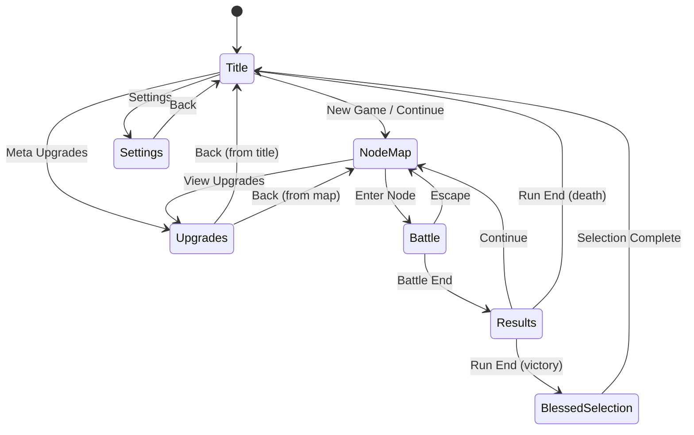
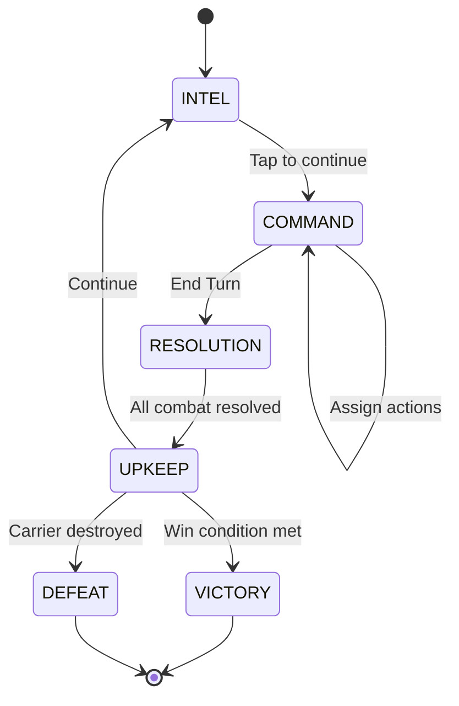

# Screen Navigation

Exodus Loop uses a state-machine approach to screen management, with `main.gd` as the central coordinator.

## Screen State Machine



---

## Screen Registry

| Screen | File | Purpose |
|--------|------|---------|
| Title | `screens/title/title_screen.tscn` | Main menu |
| NodeMap | `screens/node_map/node_map_screen.tscn` | Run navigation |
| Battle | `screens/battle/battle_screen.tscn` | Combat |
| Results | `screens/results/results_screen.tscn` | Post-battle |
| Upgrades | `screens/upgrades/upgrades_screen.tscn` | Meta-progression |
| BlessedSelection | `screens/blessed_selection/blessed_selection_screen.tscn` | Bless squadrons |
| Settings | `screens/settings/settings_screen.tscn` | Options |
| LoadoutSelection | `screens/loadout/loadout_selection_screen.tscn` | Choose starting squadrons |

---

## Transition Flow

### main.gd Coordination

```gdscript
# Screen references
var current_screen: Control = null
var screens: Dictionary = {}

func _ready() -> void:
    # Load all screens
    screens["title"] = preload("res://src/screens/title/title_screen.tscn")
    screens["battle"] = preload("res://src/screens/battle/battle_screen.tscn")
    # ... etc

    _show_screen("title")

func _on_screen_change_requested(name: String, params: Dictionary = {}) -> void:
    _transition_to_screen(name, params)

func _transition_to_screen(name: String, params: Dictionary) -> void:
    if current_screen:
        current_screen.queue_free()

    var screen_scene = screens[name]
    current_screen = screen_scene.instantiate()

    # Connect signals
    if current_screen.has_signal("screen_change_requested"):
        current_screen.screen_change_requested.connect(_on_screen_change_requested)

    # Pass params
    if current_screen.has_method("setup"):
        current_screen.setup(params)

    add_child(current_screen)
```

### Screen Base Pattern

```gdscript
extends Control

signal screen_change_requested(screen_name: String, params: Dictionary)

func setup(params: Dictionary) -> void:
    # Initialize from params
    pass

func _on_back_pressed() -> void:
    screen_change_requested.emit("previous_screen", {})
```

---

## Battle Screen State Machine

The battle screen itself has complex internal states:



### Battle Phases

```gdscript
enum BattlePhase {
    INTEL,      # Read-only, view enemy positions
    COMMAND,    # Player assigns actions
    RESOLUTION, # Execute all actions
    UPKEEP,     # Reset state for next turn
    VICTORY,    # Battle won
    DEFEAT      # Battle lost
}

var current_phase: BattlePhase = BattlePhase.INTEL
```

### Phase Transitions

```gdscript
func _advance_phase() -> void:
    match current_phase:
        BattlePhase.INTEL:
            current_phase = BattlePhase.COMMAND
            _enter_command_phase()

        BattlePhase.COMMAND:
            current_phase = BattlePhase.RESOLUTION
            await _execute_resolution()
            current_phase = BattlePhase.UPKEEP
            _process_upkeep()

        BattlePhase.UPKEEP:
            if _check_victory():
                current_phase = BattlePhase.VICTORY
            elif _check_defeat():
                current_phase = BattlePhase.DEFEAT
            else:
                current_phase = BattlePhase.INTEL
                _enter_intel_phase()
```

---

## Known Issues

### Race Condition in Transitions

**Location:** `main.gd:84-90`

Double-clicking can trigger multiple transitions:

```gdscript
# Problem: pending_destination can be overwritten
func _on_screen_change_requested(name: String, params: Dictionary) -> void:
    pending_destination = name  # Can be overwritten by second click
    _transition_to_screen(name, params)
```

**Mitigation:** Add transition lock:

```gdscript
var is_transitioning: bool = false

func _on_screen_change_requested(name: String, params: Dictionary) -> void:
    if is_transitioning:
        return
    is_transitioning = true
    await _transition_to_screen(name, params)
    is_transitioning = false
```

### Modal Cleanup

**Location:** `battle_screen.gd:266-276`

Modals may not be properly cleaned up on screen exit:

```gdscript
# Should be called in _exit_tree
func _cleanup_modals() -> void:
    for modal in active_modals:
        if is_instance_valid(modal):
            modal.queue_free()
    active_modals.clear()
```

---

## Navigation Examples

### Starting New Run

```gdscript
# From Title Screen
func _on_new_game_pressed() -> void:
    GameState.start_new_run()
    screen_change_requested.emit("node_map", {})
```

### Entering Battle

```gdscript
# From Node Map
func _on_node_selected(node_id: int) -> void:
    var node_data = GameState.get_node_data(node_id)
    screen_change_requested.emit("battle", {
        "node_id": node_id,
        "node_type": node_data.type
    })
```

### Post-Battle Flow

```gdscript
# From Battle Screen
func _on_battle_ended(victory: bool) -> void:
    screen_change_requested.emit("results", {
        "victory": victory,
        "stats": _collect_battle_stats()
    })

# From Results Screen
func _on_continue_pressed() -> void:
    if _is_run_complete():
        if victory:
            screen_change_requested.emit("blessed_selection", {})
        else:
            screen_change_requested.emit("title", {})
    else:
        screen_change_requested.emit("node_map", {})
```
