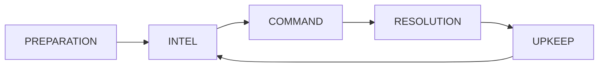

# Combat System

Exodus Loop uses **sequential initiative-based combat**, not simultaneous resolution. This is a deliberate departure from the original GDD which specified simultaneous combat.

## Combat Phases

Each battle begins with a **Preparation Phase**, followed by repeating 4-phase combat turns:



### Preparation Phase (Turn 0)

Before combat begins, position your forces:

**Deployment Zone:**
- Configurable per battle (default: 3 rows at bottom for player)
- Grid size: 11×13 cells for campaign battles
- Zone highlighted with green tint

**Ship Selection:**
- Tap any ship on grid → Info card appears with stats
- Tap ship in Fleet Roster panel → Same info card
- Holographic connection line links ship to card
- Tap empty cell to dismiss selection

**Carrier Placement:**
- Drag carrier within deployment zone to reposition
- Multi-tile ships validated to stay within grid

**Fighter Deployment:**
- Drag ships within deployment zone to reposition
- Ships with "Early Launch" trait can deploy from carrier during positioning
- Tap docked ship with trait → Launch modal appears
- Remaining fighters stay in hangar for mid-battle launches

**Fleet Roster Panels:**
- Player roster on left shows all friendly ships
- Enemy roster on right (visible in creative mode)
- Ships show current position (e.g., "@ A5") or "DOCKED"
- Tap ship in roster to select and view info

**Controls:**
- Tap ship to select and view info card
- Drag ship to reposition within deployment zone
- "Done" button transitions to INTEL phase

---

### Phase 1: INTEL

- View enemy positions and fuzzy intents (based on sensor tier)
- Read-only phase - no actions available
- Tap/click to advance

### Phase 2: COMMAND

- Assign actions to all squadrons
- Queue launches from hangar
- Set carrier actions (MOVE, REPAIR, REARM, etc.)
- Undo available before execution

### Phase 3: RESOLUTION

Execution order:
1. Execute launches (free action)
2. Set enemy intents (AI decisions)
3. Execute carrier action
4. Execute movements (sequential, with interception checks)
5. Execute landings (return to hangar)
6. Resolve combat in contested cells
7. Apply carrier damage from enemies
8. Clear all actions
9. Remove destroyed squadrons

### Phase 4: UPKEEP

- Make launched squadrons ready
- Reset AP for all units
- Apply type ability upkeep (e.g., Gunship regen)
- Apply hazard upkeep effects
- Advance jump drive charge
- Spawn reinforcements
- Check for multi-wave triggers
- Advance turn number

---

## Combat Resolution

Combat is **sequential** within each contested cell:

### Initiative System

1. All units in the contested cell roll initiative: `1d[Spd+1]`
2. Units sorted by roll (descending), then SPD stat (descending) for ties
3. Each unit attacks in order, targeting the slowest living enemy
4. **Dead units don't attack** - units destroyed earlier skip their turn

```
Example Initiative:
  Scout (SPD 4): rolls d5 = 4
  Interceptor (SPD 3): rolls d4 = 3
  Bomber (SPD 1): rolls d2 = 1

  Attack order: Scout → Interceptor → Bomber
  If Scout kills Bomber, Bomber never attacks
```

---

## Damage Formula

```
Damage = max(0, DiceRoll + ATK - DEF)
```

Where:
- **DiceRoll** = RPS-determined die (d4, d6, or d10)
- **ATK** = Attacker's effective attack
- **DEF** = Defender's effective defense

### RPS Dice Selection

| Attacker vs Defender | Die Type | Range |
|----------------------|----------|-------|
| Advantage (e.g., Interceptor vs Bomber) | d10 | 1-10 |
| Neutral (no relationship) | d6 | 1-6 |
| Disadvantage (e.g., Bomber vs Interceptor) | d4 | 1-4 |

Frigate, Destroyer, Scout, and Miner always use d6 (neutral).

### Effective Stats

**Effective ATK includes:**
- Base ATK
- Action modifier (+1 for ATTACK or DEFEND action)
- Pilot stat bonus
- Pilot morale modifier
- Trait bonuses
- Admiral bonuses (player units only)
- Fire Control Network bonus
- Accuracy modifier from grid position

**Effective DEF includes:**
- Base DEF
- Action modifier (+2 for DEFEND action)
- Pilot stat bonus
- Pilot morale modifier
- Last Stand passive (+2 when below 50% hull)
- Trait bonuses
- Hazard DEF bonus from grid position

---

## Action Modifiers

| Action | ATK Modifier | DEF Modifier |
|--------|--------------|--------------|
| ATTACK | +1 | 0 |
| DEFEND | +1 | +2 |
| MOVE | 0 | 0 |
| LAND | 0 | 0 |

---

## Special Combat Mechanics

### Destroyer Torpedo Salvo

When a Destroyer attacks:
1. Target's DEF is reduced by 1 (armor piercing)
2. Adjacent enemies to target take splash damage (1 HP)

### Interception System

Units in ATTACK or DEFEND mode can intercept enemies passing through their cell:
- Interception is one-sided (defender only)
- Moving unit stops at interception cell
- Standard combat resolution applies

### Fire Control Network

Frigates in DEFEND mode provide +1 ATK to adjacent friendly units:
- Orthogonal neighbors only (Manhattan distance 1)
- Stacks with multiple Frigates
- Frigate does NOT buff itself

---

## Combat Log Format

```
=== Combat at C3 ===
Initiative Order:
  > Enemy B-Bravo-3: 8 (SPD 3)
  + I-Alpha-1: 7 (SPD 3)
  > Enemy G-Charlie-2: 4 (SPD 2)

I-Alpha-1 [d10:7+1=8] vs Enemy G-Charlie-2 [d4:1+2=3]
  → 8/3 dmg → Both survive

Enemy B-Bravo-3 [d6:2+3=5] vs I-Alpha-1 [NO AMMO]
  → 5/0 dmg → Enemy B destroyed
```

**Legend:**
- `[dX:Y+Z=T]` = Die size : Base roll + ATK modifier = Total
- `[NO AMMO]` = Unit cannot return fire
- `[DEF+]` = DEFEND action active

---

## Win/Lose Conditions

**Win:**
- All enemies destroyed, OR
- Survive until jump drive charged (escape scenario)

**Lose:**
- Carrier destroyed (HP reaches 0)
- No fuel and no squadrons (stranded)
