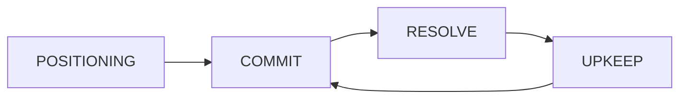

# Combat System

Exodus Loop uses a **Puzzle Pirates-inspired intent-based combat system** with simultaneous resolution. Players queue 3 movement intents per ship, then all ships execute in speed order across 3 sub-phases.

## Combat Phases

Each battle begins with a **Positioning Phase**, followed by repeating combat turns:



---

## Positioning Phase

Before combat begins, position your forces:

**Deployment Zone:**
- Configurable per battle (default: 3 rows at bottom for player)
- Grid size: 11×13 cells for campaign battles
- Zone highlighted with green tint

**Ship Selection:**
- Tap any ship on grid → Info card appears with stats
- Tap ship in Fleet Roster panel → Same info card
- Holographic connection line links ship to card
- Tap empty cell to dismiss selection

**Carrier Placement:**
- Drag carrier within deployment zone to reposition
- Multi-tile ships validated to stay within grid

**Fighter Deployment:**
- Ships with "Early Launch" trait can deploy from carrier during positioning
- Tap docked ship with trait → Launch modal appears
- Remaining fighters stay in hangar for mid-battle launches

**Controls:**
- Tap ship to select and view info card
- Drag ship to reposition within deployment zone
- "Done" button transitions to COMMIT phase

---

## Commit Phase

During COMMIT, set orders for all your ships:

### 3-Action Queue

Each ship has a 3-slot action queue for movement intents:

```
┌─────────────────── ACTION QUEUE ───────────────────┐
│  [SLOT 1]      [SLOT 2]      [SLOT 3]             │
│  FORWARD       TURN LEFT     FORWARD              │
│  🔥 FIRE       ○ HOLD        🔥 FIRE              │
└────────────────────────────────────────────────────┘
```

**Movement Intents:**
| Intent | Effect |
|--------|--------|
| FORWARD | Move 1 cell in facing direction |
| TURN_LEFT | Rotate 90° left + move diagonally |
| TURN_RIGHT | Rotate 90° right + move diagonally |
| HOLD | Stay in place, no action |
| LAND | Return to carrier (must be adjacent) |

**Fire Toggles:**
- Each slot has an independent fire toggle
- Enabled = ship attempts to fire after moving in that sub-phase
- Targets are auto-selected based on weapon arc and range

### Dynamic Movement Slots

Ships have different movement capacities based on size:

| Ship Size | Base Slots | Blocked Phases |
|-----------|------------|----------------|
| SMALL (fighters) | 3 | None |
| MEDIUM (frigates) | 2 | 1 blocked |
| LARGE (carriers) | 1 | 2 blocked |

**Blocked Phases:** Ships with fewer slots have "blocker" tokens that mark phases where they cannot move. Blockers can be dragged to different slots.

**Engine Damage:** Damaged engines reduce available slots:
- Engine health > 33%: No penalty
- Engine health 1-33%: -1 slot
- Engine health 0%: -2 slots

### Carrier Launch System

Carriers use **per-phase launch toggles** instead of movement intents:

```
┌─────────────────── CARRIER ACTIONS ────────────────┐
│  [SLOT 1]      [SLOT 2]      [SLOT 3]             │
│  FORWARD       HOLD          HOLD                 │
│  🔥 FIRE       ○ HOLD        ○ HOLD               │
│  [LNCH: Port]  [LNCH: ---]   [LNCH: Stbd]        │
└────────────────────────────────────────────────────┘
```

**LNCH Toggles:**
- Each phase has independent launch toggles per bay
- Click LNCH to cycle: `--- → Port Bay → Starboard Bay → ---`
- Multiple ships can launch in the same phase (one per bay)
- Launches happen **BEFORE** movement in each sub-phase

### Docked Ship Pre-Orders

Set orders for docked ships **before they launch**:

1. Click "☰ FLEET" button to open Fleet Roster during COMMIT
2. Select a docked ship from the roster
3. Set movement intents and fire toggles as "pre-orders"
4. Orders only execute when ship actually launches

**Pre-Order Rules:**
- If carrier doesn't launch the ship, pre-orders are ignored
- Useful for coordinated fleet maneuvers
- Launched ships can move in the same phase they launch

### Action Bars

Ships display a visual indicator of queued actions:

```
[███|░░░|░░░]  = 1 action queued
[███|███|░░░]  = 2 actions queued
[███|███|███]  = 3 actions queued
```

Segments fill based on: non-HOLD movements + enabled fires + launch orders.

---

## Single-Occupancy Tactical Mode

> **Default as of v0.5.30** - This is now the standard combat mode.

The combat system uses **single-occupancy rules**, meaning:

| Rule | Effect |
|------|--------|
| **One ship per cell** | Occupied cells block movement - ships stay in place |
| **No MBM modal** | Dogfights resolve in tactical layer, not popup |
| **Ammo on miss** | Ammo consumed even when firing at empty space |
| **Weapon cooldowns** | Weapons have cooldown turns between uses |
| **Adjacent dogfights** | Ships attack enemies in adjacent cells |

### Cell Occupancy

- When a ship attempts to move into an occupied cell, it **stays in place**
- Facing is preserved (no rotation penalty)
- Plan moves carefully to avoid traffic jams

### Tactical Dogfights

Instead of modal-based combat when ships share a cell:
- Ships fire at adjacent enemies during the fire sub-phase
- Damage is applied immediately in the tactical layer
- No separate dogfight popup

### Weapon Cooldowns

Some weapons have cooldown periods:
```
Ion Cannon: 2-turn cooldown
Standard Laser: No cooldown (fires every turn)
```

---

## Resolve Phase

All ships execute their queued actions simultaneously across 3 sub-phases.

### Sub-Phase Resolution Order

For each sub-phase (1, 2, 3):

1. **Launches** - Carriers launch ships from enabled bays
2. **Movement** - All ships execute movement intent for this slot (speed order)
3. **Collisions** - Resolve ships at same position
4. **Weapons Fire** - Ships with fire enabled attempt to shoot
5. **Dogfights** - Adjacent enemy ships may engage

### Speed-Based Movement

Ships move in order of speed (highest first):

| Ship Type | Speed | Notes |
|-----------|-------|-------|
| Interceptor | 5 | Fastest - moves first |
| Scout | 4 | Fast recon |
| Gunship | 3 | Medium |
| Bomber | 2 | Slow but powerful |
| Carrier | 1 | Slowest - moves last |

Ties broken alphabetically by ship ID for determinism.

### Movement Blocking

With single-occupancy rules:
- Ships **cannot** move into occupied cells
- Blocked ships stay in their current position
- Facing is preserved (no forced rotation)
- Plan your fleet's movement to avoid congestion

> **Note:** Capital ship collisions still apply when large ships attempt to occupy the same cell during simultaneous movement resolution.

### Weapons Fire

Ships with fire enabled for this sub-phase:
- Auto-target nearest enemy in weapon arc
- Range varies by weapon type (default: 3 cells)
- Ammo consumed per shot
- Damage calculated: `ATK + Roll - DEF`

---

## Upkeep Phase

End-of-turn maintenance:

### Component Repair

Damaged components have a chance to self-repair:

**Base Repair Chance:** 5% per turn

**Modifiers:**
- Pilot perks: +10-30%
- Ship upgrades: +5-15%
- Carrier nearby (RECOVER mode): +20%

**Repair Effects:**
- Restores 33% component health
- Clears disabled/jammed status
- Updates movement slots if engine repaired

### Other Upkeep

- Advance jump drive charge
- Spawn reinforcements (if any)
- Check victory/defeat conditions
- Advance turn counter

---

## Damage & Combat

### Damage Formula

```
Damage = max(0, DiceRoll + ATK - DEF)
```

### RPS Triangle (Dogfights)

When adjacent ships engage:

```
Interceptor > Bomber > Gunship > Interceptor
```

| Matchup | Attacker Die |
|---------|--------------|
| Advantage | d10 |
| Neutral | d6 |
| Disadvantage | d4 |

---

## Landing Ships

Ships can return to carrier using the **LAND** intent:

**Requirements:**
- Ship must be adjacent to carrier
- Carrier bay must have capacity
- Ship must be "small" class (fighters)

**Landing Flow:**
1. Assign LAND intent in action queue
2. During resolution, ship moves to carrier position
3. Ship becomes docked (removed from grid)
4. Can be re-launched on future turns

---

## Win/Lose Conditions

**Win:**
- All enemies destroyed, OR
- Survive until jump drive charged (escape scenario)

**Lose:**
- Carrier destroyed (HP reaches 0)
- No fuel and no squadrons (stranded)

---

## Reinforcements

Battles may feature multiple waves of enemies. See [[../internal/reinforcements|Reinforcement System]] for details.

**Wave Triggers:**
- Turn threshold (after X turns)
- Enemy casualties (when losses exceed %)
- Carrier damage (when enemy carrier hit)
- Distress beacon (enemy unit calls for help)

**Encounter Types:**
- Standard: 0-1 waves
- Ambush: 1-2 waves (aggressive)
- Elite: 1 wave (hunter trait)
- Boss: 2-3 waves (distress beacon)

---

## Capital Ship Combat

### Directional Damage

When attacking capital ships, damage is applied to the sector facing the attacker:

```
        FRONT
    +----------+
 L  | L  C  R  |  R
 E  |    O     |  I
 F  |    R     |  G
 T  |    E     |  H
    +----------+  T
        REAR
```

1. Attack direction determined by relative position
2. Outer components in that sector hit first
3. Damage flows inward toward Hull Core
4. Sector disabled at 50% damage

See [[carriers#directional-damage-system|Carriers - Directional Damage]] for sector effects.

### Capital Collisions

When two capital ships occupy the same cell:

| Event | Damage |
|-------|--------|
| Base collision | 2 + size difference |
| Smaller ship | +1 extra damage |
| Edge blocked | +2 instead of pushback |

Both ships are pushed 1 tile apart. Collisions can chain (max depth 2) if pushed into another ship.
