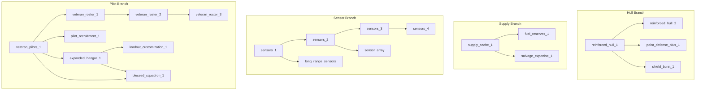

# Progression System

Exodus Loop features extensive meta-progression through 22 upgrades and a 6-skill Admiral tree.

## Meta-Upgrades (22 Total)

### Tier 1 - 5 Upgrades (50 XP each, no prerequisites)

| ID | Name | Effect |
|----|------|--------|
| reinforced_hull_1 | Reinforced Hull I | +5 Carrier HP |
| supply_cache_1 | Supply Cache | +3 Metal, +3 Energy at run start |
| sensors_1 | Sensors I | Reveal enemy aggression levels |
| veteran_pilots_1 | Veteran Pilots | Squadrons start with +1 HP |
| buoy_capacity | Buoy Capacity | +2 max recon buoys per battle (3→5) |

### Tier 2 - 10 Upgrades (75-100 XP)

| ID | Name | Cost | Prereq | Effect |
|----|------|------|--------|--------|
| reinforced_hull_2 | Reinforced Hull II | 75 | reinforced_hull_1 | +5 more Carrier HP |
| fuel_reserves_1 | Fuel Reserves | 75 | supply_cache_1 | +1 Fuel at run start |
| sensors_2 | Sensors II | 100 | sensors_1 | Reveal enemy movement paths |
| expanded_hangar_1 | Expanded Hangar | 75 | veteran_pilots_1 | +2 Hangar capacity (3→5) |
| salvage_expertise_1 | Salvage Expertise | 75 | supply_cache_1 | +25% salvage resources |
| point_defense_plus_1 | Point Defense+ | 100 | reinforced_hull_1 | Destroy enemies with HP ≤ 4 |
| shield_burst_1 | Shield Generator | 100 | reinforced_hull_1 | Absorb 3 damage once per battle |
| pilot_recruitment_1 | Field Recruiting | 75 | veteran_pilots_1 | Rest stops offer pilots (50% chance) |
| long_range_sensors | Long Range Sensors | 75 | sensors_1 | Carrier detection range +1 |
| sensor_array | Sensor Array | 100 | sensors_2 | All units detection range +1 |

### Tier 3 - 4 Upgrades (100-150 XP)

| ID | Name | Cost | Prereq | Effect |
|----|------|------|--------|--------|
| sensors_3 | Sensors III | 150 | sensors_2 | Reveal enemy fuel levels |
| blessed_squadron_1 | Blessed Squadron | 150 | veteran_pilots_1 + expanded_hangar_1 | 1 squadron persists between runs |
| loadout_customization_1 | Custom Loadout | 150 | expanded_hangar_1 | Choose starting squadrons |
| veteran_roster_1 | Veteran Roster I | 100 | veteran_pilots_1 | 1 pilot carries over between runs |

### Tier 4 - 3 Upgrades (150-200 XP)

| ID | Name | Cost | Prereq | Effect |
|----|------|------|--------|--------|
| veteran_roster_2 | Veteran Roster II | 150 | veteran_roster_1 | 2 pilots carry over |
| veteran_roster_3 | Veteran Roster III | 150 | veteran_roster_2 | 3 pilots carry over |
| sensors_4 | Sensors IV | 200 | sensors_3 | Reveal enemy intent/actions |

---

## Upgrade Tree Structure

**Key Hub Upgrades:**
- `expanded_hangar_1`: Required for both blessed_squadron_1 AND loadout_customization_1
- `sensors_2`: Gateway to sensor_array AND sensors_3

**Longest Path:** sensors_1→2→3→4 (4 steps, 500 XP total)

---

## Sensor Tier System

| Tier | Upgrade | Cumulative Cost | Information Revealed |
|------|---------|-----------------|---------------------|
| 0 | — | — | Basic combat info only |
| 1 | sensors_1 | 50 | Enemy aggression levels |
| 2 | sensors_2 | 150 | + Enemy movement paths |
| 3 | sensors_3 | 300 | + Enemy fuel levels |
| 4 | sensors_4 | 500 | + Enemy intent/actions |

Sensor tier only reveals information—it doesn't lock gameplay content.

---

## Admiral Skill Tree

### Leveling

| Level | XP for Next | Cumulative XP |
|-------|-------------|---------------|
| 0 → 1 | 100 | 100 |
| 1 → 2 | 250 | 350 |
| 2 → 3 | 450 | 800 |
| 3 → 4 | 700 | 1500 |
| 4 → 5 | 1000 | 2500 |
| 5 → 6 | 1500 | 4000 |

**Max Level:** 6
**Skill Points:** 1 per level (6 total)

### Skills (SURVIVAL_FIRST Branch)

#### Tier 1 (Available Immediately)

| Skill | Stat | Value | Description |
|-------|------|-------|-------------|
| LAST_STAND | atk_bonus_low_hp | +1 ATK | Squadrons gain +1 ATK when below 50% HP |
| EMERGENCY_REPAIRS | carrier_heal_end | +1 HP | Carrier heals 1 HP at end of battle if damaged |

#### Tier 2 (Require 1 Tier 1)

| Skill | Stat | Value | Description |
|-------|------|-------|-------------|
| EJECT_PROTOCOL | pilot_survival_chance | 0.20 | 20% chance pilot survives squadron death |
| RALLY_CRY | first_squadron_ap | +1 AP | First squadron each battle gets +1 AP |

#### Tier 3 (Require 1 Tier 2)

| Skill | Stat | Value | Description |
|-------|------|-------|-------------|
| IRON_WILL | carrier_first_hit_reduction | -1 dmg | Carrier takes -1 damage from first hit |
| DESPERATE_MEASURES | atk_bonus_carrier_critical | +2 ATK | Squadrons deal +2 damage when carrier below 25% HP |

---

## Blessed Squadrons

**Unlock:** blessed_squadron_1 (150 XP, requires veteran_pilots_1 + expanded_hangar_1)

**Mechanics:**
- 1 squadron slot available when unlocked
- Blessed squadrons persist between runs
- Stats frozen at time of blessing
- Pilot assignment retained (if pilot alive and carried over)

**Blessing Process:**
1. Complete run (survive or die)
2. Select surviving squadron on BlessedSelectionScreen
3. Squadron saved to meta-progression
4. Automatically added to hangar on next run start

---

## Starting Resources

**Base (no upgrades):**
- Metal: 10
- Energy: 10
- Fuel: 3

**With supply_cache_1:** +3 Metal, +3 Energy
**With fuel_reserves_1:** +1 Fuel

**Hangar Capacity:**
- Base: 3 squadrons
- With expanded_hangar_1: 5 squadrons
