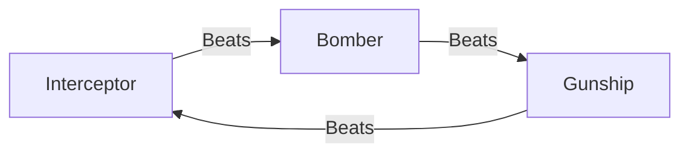

# Squadron Types

Exodus Loop features **7 squadron types**: 3 in the RPS triangle (Interceptor, Bomber, Gunship) and 4 specialist types outside it (Frigate, Destroyer, Scout, Miner).

## Stat Overview

| Type | SPD | ATK | DEF | Hull | Ammo | Fuel | Move | Detection | Special |
|------|-----|-----|-----|------|------|------|------|-----------|---------|
| Interceptor | 3 | 1 | 1 | 3 | 3 | 5 | 2 | 1 | Fuel Efficiency |
| Bomber | 1 | 3 | 1 | 4 | 3 | 2 | 1 | 1 | Heavy Payload |
| Gunship | 2 | 2 | 3 | 5 | 3 | 3 | 1 | 1 | Regen Armor |
| Frigate | 2 | 1 | 2 | 4 | 5 | 4 | 1 | 2 | Fire Control Network |
| Destroyer | 2 | 3 | 1 | 5 | 3 | 3 | 1 | 1 | Torpedo Salvo |
| Scout | 4 | 1 | 1 | 2 | 2 | 5 | 2 | 3 | Extended Sensors |
| Miner | 1 | 0 | 1 | 3 | 0 | 4 | 1 | 1 | Resource Extraction |

---

## RPS Triangle Types

### Interceptor (Type Code: I)

**Role:** Fast anti-air fighter with high initiative

- **Stats:** SPD 3, ATK 1, DEF 1, Hull 3, Ammo 3, Fuel 4→5, Move 2
- **RPS:** Beats Bomber, loses to Gunship
- **Passive:** "Fuel Efficiency" - +1 Max Fuel (4→5)
- **Cost:** 2 Metal

Interceptors excel at hunting down Bombers and have the highest initiative in the RPS triangle. Their extended movement range (2 cells) allows quick repositioning.

### Bomber (Type Code: B)

**Role:** Heavy damage dealer, carrier killer

- **Stats:** SPD 1, ATK 3, DEF 1, Hull 4, Ammo 2→3, Fuel 2, Move 1
- **RPS:** Beats Gunship, loses to Interceptor
- **Passive:** "Heavy Payload" - +1 Max Ammo (2→3)
- **Cost:** 2 Energy

Bombers deal the highest damage in the game (ATK 3) but are slow and vulnerable to Interceptors. Position them carefully behind defensive lines.

### Gunship (Type Code: G)

**Role:** Balanced tank with defensive stance

- **Stats:** SPD 2, ATK 2, DEF 3, Hull 5, Ammo 3, Fuel 3, Move 1
- **RPS:** Beats Interceptor, loses to Bomber
- **Passive:** "Regenerative Armor" - Heal 1 HP at end of each turn
- **Cost:** 1 Metal + 1 Energy

Gunships are the tankiest RPS unit with the highest DEF (3) and Hull (5). Their regeneration makes them excellent for holding positions.

---

## Specialist Types (Outside RPS)

### Frigate (Type Code: F)

**Role:** Command escort & tactical coordinator

- **Stats:** SPD 2, ATK 1, DEF 2, Hull 4, Ammo 5, Fuel 4, Move 1, Detection 2
- **RPS:** None - always rolls d6
- **Passive:** "Fire Control Network (FCN)" - Adjacent friendly squadrons gain +1 ATK when Frigate is in DEFEND mode
- **Cost:** 2 Metal + 1 Energy
- **Restriction:** Cannot land on carrier (capital ship)

**FCN Mechanics:**
- Activates only when Frigate is in DEFEND action
- Affects orthogonal neighbors (Manhattan distance 1)
- Stacks with multiple Frigates
- Frigate does NOT buff itself

### Destroyer (Type Code: D)

**Role:** Heavy assault & torpedo platform (glass cannon)

- **Stats:** SPD 2, ATK 3, DEF 1, Hull 5, Ammo 3, Fuel 3, Move 1
- **RPS:** None - always rolls d6
- **Passive:** "Torpedo Salvo" - Primary target's DEF reduced by 1, splash damage to adjacent enemies
- **Cost:** 2 Metal + 1 Energy

Destroyers share the highest ATK (3) with Bombers but trade type advantage for armor-piercing capability.

### Scout (Type Code: S)

**Role:** Fast reconnaissance & fog of war clearer

- **Stats:** SPD 4, ATK 1, DEF 1, Hull 2, Ammo 2, Fuel 5, Move 2, Detection 3
- **RPS:** None - always rolls d6
- **Passive:** "Extended Sensors" - Reveals fog of war in 3-cell radius
- **Cost:** 1 Metal + 1 Energy

Scouts have the highest SPD (4) and Detection (3) but are extremely fragile (Hull 2). Use them for reconnaissance, not combat.

### Miner (Type Code: M)

**Role:** Resource extractor (non-combat utility)

- **Stats:** SPD 1, ATK 0, DEF 1, Hull 3, Ammo 0, Fuel 4, Move 1
- **RPS:** None - cannot attack
- **Passive:** "Resource Extraction" - Can harvest adjacent asteroids
- **Cost:** Deployment-dependent

Miners have no combat capability (ATK 0, Ammo 0). They exist solely for resource gathering from harvestable asteroids.

---

## RPS Advantage System

**Damage Dice:**
- **Advantage:** Roll d10 (1-10 range)
- **Neutral:** Roll d6 (1-6 range)
- **Disadvantage:** Roll d4 (1-4 range)

Frigate, Destroyer, Scout, and Miner always roll d6 (neutral).

---

## Naming Convention

**Callsign Format:** `[Type Code]-[Wing Letter]-[Wing Number]`

**Examples:**
- I-Alpha-1 (Interceptor #1 from Alpha wing)
- D-Bravo-3 (Destroyer #3 from Bravo wing)
- S-Charlie-2 (Scout #2 from Charlie wing)

**Wing Letters:** Alpha, Bravo, Charlie, Delta, Echo, Foxtrot, Golf, Hotel, India, Juliet, Kilo, Lima

---

## Ability Summary

| Type | Ability | Trigger | Effect |
|------|---------|---------|--------|
| Interceptor | Fuel Efficiency | Passive (creation) | +1 Max Fuel permanently |
| Bomber | Heavy Payload | Passive (creation) | +1 Max Ammo permanently |
| Gunship | Regenerative Armor | Upkeep (each turn) | Heal 1 HP (capped at max) |
| Frigate | Fire Control Network | When in DEFEND | +1 ATK to adjacent allies |
| Destroyer | Torpedo Salvo | On Attack | DEF-1 on target, splash to adjacent |
| Scout | Extended Sensors | Always active | Fog clear radius 3 |
| Miner | Resource Extraction | Action | Harvest adjacent asteroids |
